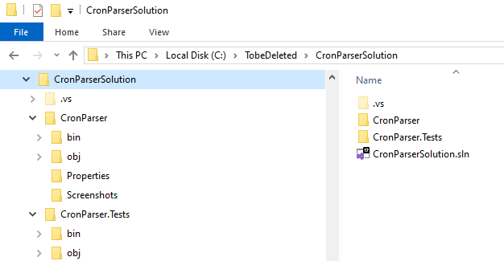
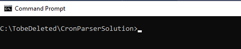
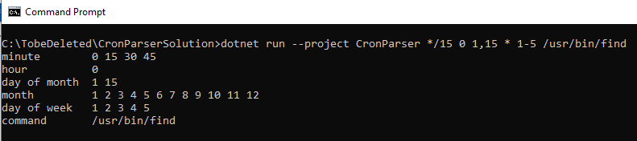
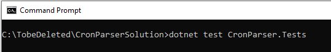
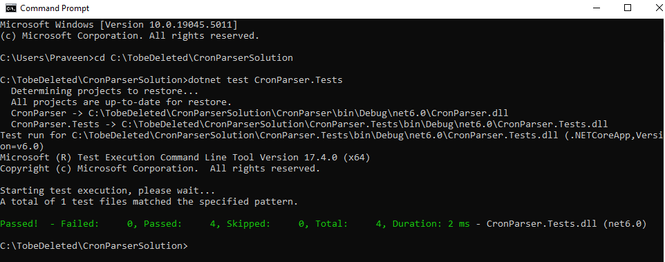

# CronParser

## Tech stack:
This application is built using command line application in .net 6.0 on Visual Studio 2022 and unit test is added using xUnit.

## For usage information see below:

### Unzip CronParserSolution.zip file:

Assuming that you have downloaded the solutoin from Github repository as CronParserSolution.zip and then unzipped it in C:\TobeDeleted folder on windows, then the unzipped folder should look like below:

### Open Command line application in windows and then change folder as shown below:

### Running the application:
To run the application, use the following command in folder C:\TobeDeleted\CronParserSolution as shown below:

### dotnet run --project CronParser */15 0 1,15 * 1-5 /usr/bin/find

### Solution output:

### Running the unit test:

To run the application, use the following command in folder C:\TobeDeleted\CronParserSolution as shown below:

### dotnet test CronParser.Tests

### Unit Test Result:

